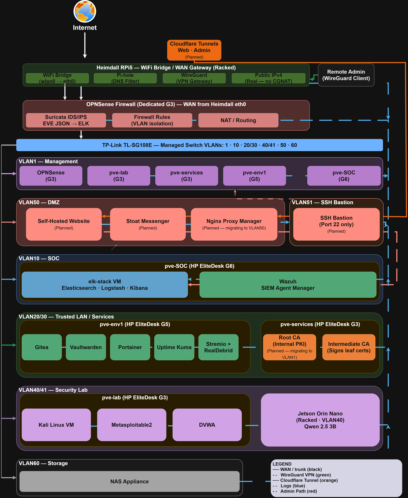

# dcollins-homelab

A self-built, enterprise-style homelab running production-grade infrastructure across a four-node Proxmox cluster. This repository documents the architecture, design decisions, and operational procedures behind what I have built and where it is going.

Everything here is real and running. Where something is planned or in progress, it is noted as such.

---

## What This Is

This is not a tutorial lab. It is a working environment I use to develop hands-on skills in network engineering, security operations, virtualization, and systems administration. I built it from scratch, manage it myself, and treat it with the same discipline I would apply to a professional environment, documented procedures, internal PKI, segmented networks, centralized logging, and a running SIEM.

The stack covers:

- Four-node Proxmox VE cluster with production VMs across segmented VLANs
- OPNSense firewall with Suricata IDS/IPS and full VLAN isolation
- Wazuh SIEM with agents deployed across eight active endpoints
- Elastic Stack 8.19 with twelve active security dashboards
- Internal PKI with a Root CA and Intermediate CA issuing TLS certificates across all services
- Dedicated security lab environment for penetration testing and adversary simulation
- WireGuard VPN for secure remote administration

---

## Network Architecture

The network is segmented into discrete VLANs enforced at both the firewall and managed switch layers. Each VLAN operates under a default-deny firewall policy with explicit allowlists for required traffic flows. No VLAN has unrestricted access to another.

Full topology documentation: [docs/network.md](docs/network.md)

### VLAN Summary

| VLAN | Name | Purpose | Status |
|------|------|---------|--------|
| 1 | Management | Proxmox nodes, OPNSense management | Live |
| 10 | SOC | ELK Stack, Wazuh Manager | Live |
| 20/30 | Trusted LAN / Services | Self-hosted services, internal PKI | Live |
| 40/41 | Security Lab | Kali, Metasploitable2, DVWA, Jetson | Live |
| 50 | DMZ | Public-facing services via Cloudflare Tunnel | Live |
| 51 | SSH Bastion | Hardened single SSH entry point | Planned |
| 60 | Storage | NAS appliance | Live |

---

## Hardware

### Proxmox Cluster

| Node | Hardware | Role |
|------|----------|------|
| pve-lab | HP EliteDesk G3 | Security lab VMs, attack platform |
| pve-services | HP EliteDesk G3 | Internal services, PKI |
| pve-env1 | HP EliteDesk G5 | Production services, Docker workloads |
| pve-SOC | HP EliteDesk G6 | SOC stack (ELK + Wazuh) |

### Supporting Hardware

| Device | Role |
|--------|------|
| Heimdall (RPi5) | WiFi bridge, WAN gateway, Pi-hole DNS, WireGuard VPN |
| OPNSense (HP EliteDesk G3) | Dedicated firewall, Suricata IDS/IPS, VLAN routing |
| TP-Link TL-SG108E | Managed switch, VLAN tagging and trunking |
| Jetson Orin Nano | AI inference node, VLAN40, racked |

---

## VM Inventory

| VM | Host | Network | Role | Status |
|----|------|---------|------|--------|
| services-host (VM 200) | pve-env1 | VLAN20 | Docker Host 1 | Live |
| kalshi-mm (VM 290) | pve-env1 | VLAN20 | Market maker app | Live |
| services-host2 (VM 700) | pve-env1 | VLAN20 | Docker Host 2 | Live |
| soc-stack (VM 600) | pve-SOC | VLAN10 | Elasticsearch, Logstash, Kibana | Live |
| wazuh-manager (VM 601) | pve-SOC | VLAN10 | Wazuh SIEM manager | Live |
| ubuntu (VM 401) | pve-services | VLAN30 | General services | Live |
| pve-ca-root (VM 500) | pve-services | VLAN30 | Root CA | Live |
| pve-ca-intermediate (VM 501) | pve-services | VLAN30 | Intermediate CA | Live |
| kali-attack (VM 300) | pve-lab | VLAN40 | Penetration testing | Live |
| metasploitable2 (VM 301) | pve-lab | VLAN41 | Vulnerable target | Live |
| dvwa (VM 302) | pve-lab | VLAN41 | Vulnerable web app | Live |
| malware-win11 (VM 400) | pve-lab | VLAN41 | Malware analysis sandbox | Live |

---

## SOC Stack

The SOC environment is built on Elastic Stack 8.19 and Wazuh v4.14.4, running on dedicated hardware in an isolated VLAN with TLS enforced across all components.

**Custom dashboards:**

- SIEM Baseline
- OPNSense Firewall
- Proxmox Infrastructure
- Heimdall Gateway
- Jetson
- Suricata SOC

**Wazuh dashboards (imported):** Seven official Wazuh dashboards active covering security events, vulnerability management, compliance, and agent status.

Wazuh agents are deployed across eight active endpoints. OPNSense is monitored via agentless SSH. The Wazuh indexer connects to Elasticsearch over HTTPS using internal PKI certificates. Fourteen wazuh-states-* indices confirmed active.

Full SOC documentation: [docs/soc-stack.md](docs/soc-stack.md)

---

## Internal PKI

All internal services communicate over TLS using certificates issued by an internal certificate authority hierarchy. The PKI runs on isolated VMs in pve-services.

- Root CA signs the Intermediate CA only. The root private key is kept offline.
- Intermediate CA issues leaf certificates to all internal services.
- Certificates are deployed across Elasticsearch, Kibana, Wazuh, Nginx Proxy Manager, and all Proxmox nodes.
- The Root CA is planned to migrate to the management VLAN for improved isolation.

Full PKI documentation: [docs/pki.md](docs/pki.md)

---

## Self-Hosted Services

Running on pve-env1 (VLAN20/30) via Docker:

| Service | Purpose |
|---------|---------|
| Gitea | Self-hosted Git server |
| Vaultwarden | Password manager (Bitwarden-compatible) |
| Portainer | Container management |
| Uptime Kuma | Service uptime monitoring |
| Stremio | Media server |

---

## Security Lab

The security lab runs in VLAN40/41, fully isolated from all production VLANs with no route to internal services and restricted outbound internet access. It hosts a Kali Linux attack VM, Metasploitable2, DVWA, and a Windows 11 malware analysis sandbox.

The Jetson Orin Nano (VLAN40) runs local AI inference and is racked alongside the cluster.

Full lab documentation: [docs/security-lab.md](docs/security-lab.md)

---

## Planned Work

| Item | Description |
|------|-------------|
| VLAN51 SSH Bastion | Hardened single-entry SSH gateway replacing direct node access |
| Cloudflare Tunnels | Zero-trust ingress for public services, no open inbound ports |
| Self-Hosted Website | Personal site and portfolio hosted in DMZ |
| Stoat Messenger | Self-hosted messaging |
| Root CA migration | Move Root CA to VLAN1 management for improved isolation |
| Suricata IPS mode | Promote from detection-only to inline blocking |

---

## Documentation

### Architecture and Infrastructure

| Document | Description |
|----------|-------------|
| [docs/network.md](docs/network.md) | Full network topology, VLAN design, and firewall architecture |
| [docs/infrastructure.md](docs/infrastructure.md) | Proxmox cluster, node configuration, and VM layout |
| [docs/soc-stack.md](docs/soc-stack.md) | ELK Stack and Wazuh deployment, dashboards, and agent rollout |
| [docs/pki.md](docs/pki.md) | Internal PKI architecture, certificate issuance, and TLS deployment |
| [docs/security-lab.md](docs/security-lab.md) | Security lab environment and penetration testing setup |

### Standard Operating Procedures

| Document | Description |
|----------|-------------|
| [docs/sop-sec-001.md](docs/sop-sec-001.md) | SOP: Homelab Security Hardening, Pre-Internet Exposure Readiness |
| [docs/sop-vlan-implementation.md](docs/sop-vlan-implementation.md) | SOP: VLAN Implementation with OPNSense and Managed Switch |

### SOC Operational Procedures

| Document | Description |
|----------|-------------|
| [docs/soc/soc-phase1-baseline.md](docs/soc/soc-phase1-baseline.md) | Phase 1: Establishing a SIEM Baseline |
| [docs/soc/soc-phase2-tuning.md](docs/soc/soc-phase2-tuning.md) | Phase 2: Noise Reduction and Rule Tuning |
| [docs/soc/soc-phase3-triage.md](docs/soc/soc-phase3-triage.md) | Phase 3: Alert Triage Workflow |
| [docs/soc/soc-phase4-iris.md](docs/soc/soc-phase4-iris.md) | Phase 4: Case Management with DFIR-IRIS |
| [docs/soc/soc-phase5-response.md](docs/soc/soc-phase5-response.md) | Phase 5: Active Response and Forensic Collection |

### SOC Implementation Records

| Document | Description |
|----------|-------------|
| [docs/soc/Implementation/soc-phase1-baseline-report-public.md](docs/soc/Implementation/soc-phase1-baseline-report-public.md) | Phase 1 Baseline Report — April 2026 |
| [docs/soc/Implementation/soc-phase2-session-summary-public.md](docs/soc/Implementation/soc-phase2-session-summary-public.md) | Phase 2 Session Summary — April 2026 |

### Runbooks and Incident Records

| Document | Description |
|----------|-------------|
| [docs/runbooks/runbook-vlan-failure-postmortem.md](docs/runbooks/runbook-vlan-failure-postmortem.md) | Post-mortem: VLAN Implementation Failure — January 2026 |
| [docs/runbooks/runbook-vlan-recovery.md](docs/runbooks/runbook-vlan-recovery.md) | Recovery: VLAN Implementation Continuation |
| [docs/runbooks/runbook-vlan-connectivity-fixes-jan2026.md](docs/runbooks/runbook-vlan-connectivity-fixes-jan2026.md) | Runbook: VLAN Connectivity Troubleshooting — January 2026 |
| [docs/runbooks/runbook-vlan-security-lab-troubleshooting.md](docs/runbooks/runbook-vlan-security-lab-troubleshooting.md) | Runbook: Security Lab VLAN Troubleshooting |
| [docs/runbooks/runbook-proxmox-subnet-migration.md](docs/runbooks/runbook-proxmox-subnet-migration.md) | Runbook: Proxmox Subnet Migration — 192.168.100.x to 10.0.0.x |
| [docs/runbooks/runbook-incident-review-march30.md](docs/runbooks/runbook-incident-review-march30.md) | Incident Review: SOC DNS and Firewall Gaps — March 2026 |
| [docs/runbooks/runbook-session-log-march30.md](docs/runbooks/runbook-session-log-march30.md) | Session Log: SOC TLS Hardening and Wazuh Deployment — March 2026 |

---

## Certifications and Education

- CompTIA A+ (March 2026)
- CompTIA Network+ (In Progress, 2026)
- B.S. Cybersecurity and Information Assurance, Western Governors University (Expected November 2026)
