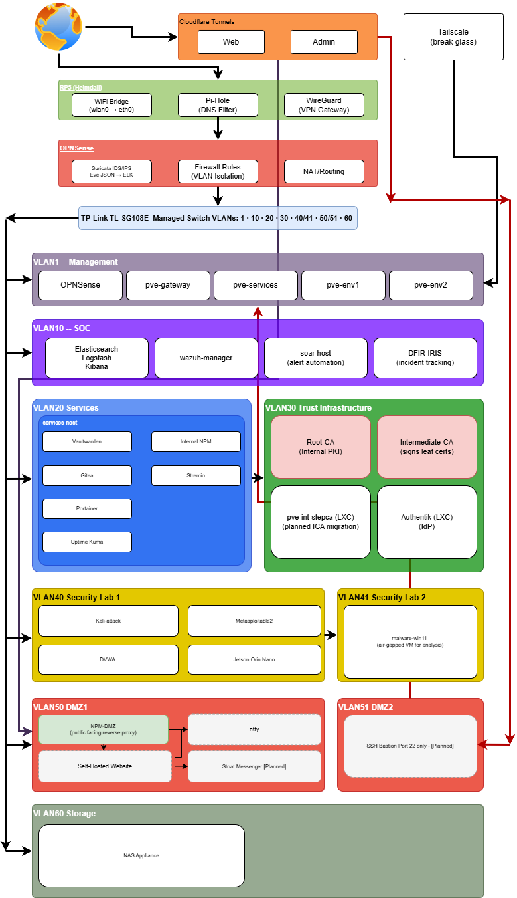

# dcollins-homelab

A self-built, enterprise-style homelab running production-grade infrastructure across a four-node Proxmox cluster. This repository documents the architecture, design decisions, and operational procedures behind what I have built and where it is going.

Everything here is real and running. Where something is planned or in progress, it is noted as such.

---

## What This Is

This is not a tutorial lab. It is a working environment I use to develop hands-on skills in network engineering, security operations, virtualization, and systems administration. I built it from scratch, manage it myself, and treat it with the same discipline I would apply to a professional environment; documented procedures, internal PKI, segmented networks, centralized logging, and a running SIEM.

The stack covers:

- Four-node Proxmox VE cluster with production VMs across segmented VLANs
- OPNSense firewall with Suricata IDS and full VLAN isolation
- Wazuh SIEM with agents deployed across cluster endpoints
- Elastic Stack 8.19 with active security dashboards covering detection, infrastructure, and compliance
- Internal PKI with a Root CA and Intermediate CA issuing TLS certificates across all services, migrating toward step-ca
- Alert automation (Shuffle SOAR) and incident case management (DFIR-IRIS)
- Dedicated security lab environment for penetration testing and adversary simulation
- WireGuard VPN, Cloudflare Tunnels, and Tailscale for layered remote administration

---

## Network Architecture

The network is segmented into discrete VLANs enforced at both the firewall and managed switch layers. Each VLAN operates under a default-deny firewall policy with explicit allowlists for required traffic flows. No VLAN has unrestricted access to another.

Full topology documentation: [docs/network.md](docs/network.md)

### VLAN Summary

| VLAN | Name | Purpose | Status |
|---|---|---|---|
| 1 | Management | Proxmox nodes, OPNSense management | Live |
| 10 | SOC | ELK Stack, Wazuh Manager, Shuffle SOAR, DFIR-IRIS | Live |
| 20 | Services | Self-hosted services (Gitea, Vaultwarden, Portainer, Uptime Kuma, Stremio, internal NPM) | Live |
| 30 | Trust Infrastructure | Internal PKI (Root/Intermediate CA), Authentik IdP, step-ca | Live |
| 40 | Security Lab 1 | Kali, Metasploitable2, DVWA, Jetson (flat network) | Live |
| 41 | Security Lab 2 | Windows 11 malware sandbox (fully air-gapped) | Live |
| 50 | DMZ1 | Public-facing services via Cloudflare Tunnel | Live |
| 51 | DMZ2 / SSH Bastion | Hardened single SSH entry point | Live |
| 60 | Storage | NAS appliance | Planned |

---

## Hardware

### Proxmox Cluster

| Node | Hardware | Role |
|---|---|---|
| pve-gateway | HP EliteDesk G3 | Security lab VMs, attack platform |
| pve-services | HP EliteDesk G3 | Internal services, PKI, trust infrastructure |
| pve-env1 | HP EliteDesk G5 | Production services, Docker workloads, SOC automation |
| pve-env2 | HP EliteDesk G6 | SOC stack (ELK + Wazuh) |

### Supporting Hardware

| Device | Role |
|---|---|
| Heimdall (RPi5) | WiFi bridge, WAN gateway, Pi-hole DNS, WireGuard VPN |
| OPNSense (HP EliteDesk G3) | Dedicated firewall, Suricata IDS, VLAN routing |
| TP-Link TL-SG108E | Managed switch, VLAN tagging and trunking |
| Jetson Orin Nano | AI inference node, VLAN40, racked |

### VM Inventory

| VM | Host | Network | Role | Status |
|---|---|---|---|---|
| services-host (VM 200) | pve-env1 | VLAN20 | Docker Host 1 | Live |
| soar-host (VM 602) | pve-env1 | VLAN10 | Shuffle SOAR — alert automation | Live |
| docker-host.template (VM 603) | pve-env1 | — | Template for cloning new Docker-host VMs | Template |
| pve-iris (VM 604) | pve-env1 | VLAN10 | DFIR-IRIS — incident case tracking | Live |
| soc-stack (VM 600) | pve-env2 | VLAN10 | Elasticsearch, Logstash, Kibana | Live |
| wazuh-manager (VM 601) | pve-env2 | VLAN10 | Wazuh SIEM manager | Live |
| ubuntu (VM 401) | pve-services | VLAN30 | General services | Live |
| pve-ca-root (VM 500) | pve-services | VLAN30 | Root CA | Live |
| pve-ca-intermediate (VM 501) | pve-services | VLAN30 | Intermediate CA | Live |
| Authentik (LXC 2201) | pve-services | VLAN30 | Self-hosted IdP/SSO | Live |
| pve-int-stepca (LXC 511) | pve-services | VLAN30 | step-ca (Docker-in-LXC), planned Intermediate CA replacement | In progress |
| pve-bastion (LXC 2202) | pve-services | VLAN51 | SSH Bastion, WARP-based Zero Trust access | In progress |
| pve-authtunnel (LXC 2100) | pve-services | VLAN50 | Dedicated Cloudflare Tunnel publishing Authentik for Zero Trust auth | Live |
| kali-attack (VM 300) | pve-gateway | VLAN40 | Penetration testing | Live |
| metasploitable2 (VM 301) | pve-gateway | VLAN40 | Vulnerable target | Live |
| dvwa (VM 302) | pve-gateway | VLAN40 | Vulnerable web app | Live |
| malware-win11 (VM 400) | pve-gateway | VLAN41 | Malware analysis sandbox (air-gapped) | Live |

---

## SOC Stack

The SOC environment is built on Elastic Stack 8.19 and Wazuh v4.14, running on dedicated hardware in an isolated VLAN with TLS enforced across all components. Beyond detection and log analysis, the SOC now includes alert automation via Shuffle SOAR and incident case management via DFIR-IRIS, with a debounce workflow that avoids creating a ticket on every transient outage.

Dashboards:

- SIEM Baseline
- OPNSense Firewall
- Proxmox Infrastructure
- Heimdall Gateway
- Jetson
- Suricata SOC
- The full set of official Wazuh dashboards (security events, vulnerability management, compliance, agent status)

Wazuh agents are deployed across cluster endpoints. OPNSense is monitored via agentless SSH. The Wazuh indexer connects to Elasticsearch over HTTPS using internal PKI certificates.

Full SOC documentation: [docs/soc-stack.md](docs/soc-stack.md)

---

## Internal PKI

All internal services communicate over TLS using certificates issued by an internal certificate authority hierarchy. The PKI runs on isolated VMs in pve-services, on the Trust Infrastructure VLAN alongside Authentik (self-hosted IdP/SSO).

- Root CA signs the Intermediate CA only. The root private key is kept offline.
- Intermediate CA issues leaf certificates to all internal services.
- Certificates are deployed across Elasticsearch, Kibana, Wazuh, Nginx Proxy Manager, and all Proxmox nodes.
- The Intermediate CA is migrating from raw OpenSSL to step-ca, part of a longer-term goal of building a fully self-hosted, low-cost PKI/identity stack.

Full PKI documentation: [docs/pki.md](docs/pki.md)

---

## Self-Hosted Services

Running on services-host (pve-env1, VLAN20) via Docker:

| Service | Purpose |
|---|---|
| Gitea | Self-hosted Git server |
| Vaultwarden | Password manager (Bitwarden-compatible) |
| Portainer | Container management |
| Uptime Kuma | Service uptime monitoring |
| Stremio | Media server |

---

## Security Lab

The security lab runs across VLAN40 and VLAN41, fully isolated from all production VLANs. VLAN40 is a flat network hosting Kali Linux, Metasploitable2, DVWA, and the Jetson Orin Nano, with restricted outbound internet for tool updates. VLAN41 is a separate, fully air-gapped segment reserved for the Windows 11 malware analysis sandbox, with no route to or from any other VLAN, including VLAN40.

Full lab documentation: [docs/security-lab.md](docs/security-lab.md)

---

## Planned Work

| Item | Description |
|---|---|
| SSH Bastion enrollment completion | WARP Zero Trust device enrollment is configured end to end but currently blocked by a browser-side QUIC protocol error on the final authorize step |
| Self-Hosted Website | Personal site and portfolio hosted in DMZ |
| Stoat Messenger | Self-hosted messaging |
| step-ca migration | Complete cutover of the Intermediate CA from raw OpenSSL to step-ca |
| Suricata IPS mode | Promote from detection-only to inline blocking |
| Storage VLAN buildout | Deploy NAS appliance on VLAN60 |

---

## Documentation

### Architecture and Infrastructure

| Document | Description |
|---|---|
| [docs/network.md](docs/network.md) | Full network topology, VLAN design, and firewall architecture |
| [docs/infrastructure.md](docs/infrastructure.md) | Proxmox cluster, node configuration, and VM layout |
| [docs/soc-stack.md](docs/soc-stack.md) | ELK Stack and Wazuh deployment, dashboards, and agent rollout |
| [docs/pki.md](docs/pki.md) | Internal PKI architecture, certificate issuance, and TLS deployment |
| [docs/security-lab.md](docs/security-lab.md) | Security lab environment and penetration testing setup |

### Standard Operating Procedures

[docs/sop/](docs/sop/)

### Runbooks

Task-level, repeatable procedures for operating each piece of software in this stack, distinct from the Incidents and Sessions below, which are historical records rather than reusable procedures.

- [docs/runbooks/opnsense/](docs/runbooks/opnsense/)
- [docs/runbooks/proxmox/](docs/runbooks/proxmox/)
- [docs/runbooks/authentik/](docs/runbooks/authentik/)
- [docs/runbooks/elk/](docs/runbooks/elk/)
- [docs/runbooks/npm/](docs/runbooks/npm/)
- [docs/runbooks/pihole/](docs/runbooks/pihole/)
- [docs/runbooks/pki/](docs/runbooks/pki/)
- [docs/runbooks/cloudflare-tunnel/](docs/runbooks/cloudflare-tunnel/)

### SOC Operational Procedures

[docs/soc/](docs/soc/)

### SOC Implementation Records

[docs/soc/Implementation/](docs/soc/Implementation/)

### Incidents

[docs/incidents/](docs/incidents/)

### Sessions

[docs/sessions/](docs/sessions/)

---

## Certifications and Education

- CompTIA A+ (March 2026)
- CompTIA Network+ (June 2026)
- B.S. Cybersecurity and Information Assurance, Western Governors University (Expected November 2026)
